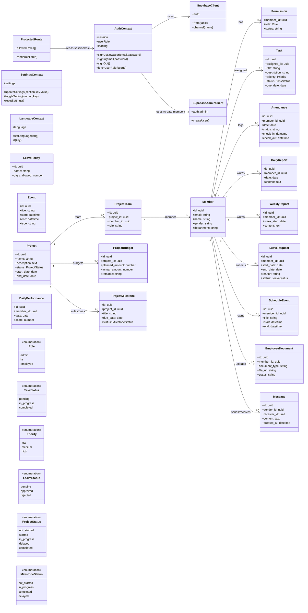

# 1) Class Diagram (Domain + Key Services)

```mermaid
classDiagram
direction LR

class SupabaseClient {
  +auth
  +from(table)
  +channel(name)
}

class SupabaseAdminClient {
  +auth.admin
  +createUser()
}

class AuthContext {
  +session
  +userRole
  +loading
  +signUpNewUser(email,password)
  +signIn(email,password)
  +signOut()
  +fetchUserRole(userId)
}

class ProtectedRoute {
  +allowedRoles[]
  +render(children)
}

class SettingsContext {
  +settings
  +updateSettings(section,key,value)
  +toggleSetting(section,key)
  +resetSettings()
}

class LanguageContext {
  +language
  +setLanguage(lang)
  +t(key)
}

%% --- Domain entities inferred from Supabase tables ---
class Member {
  +id: uuid
  +email: string
  +name: string
  +gender: string
  +department: string
}

class Permission {
  +member_id: uuid
  +role: Role
  +status: string
}

class Task {
  +id: uuid
  +assignee_id: uuid
  +title: string
  +description: string
  +priority: Priority
  +status: TaskStatus
  +due_date: date
}

class Attendance {
  +id: uuid
  +member_id: uuid
  +date: date
  +status: string
  +check_in: datetime
  +check_out: datetime
}

class DailyReport {
  +id: uuid
  +member_id: uuid
  +date: date
  +content: text
}

class WeeklyReport {
  +id: uuid
  +member_id: uuid
  +week_start: date
  +content: text
}

class LeaveRequest {
  +id: uuid
  +member_id: uuid
  +start_date: date
  +end_date: date
  +reason: string
  +status: LeaveStatus
}

class LeavePolicy {
  +id: uuid
  +name: string
  +days_allowed: number
}

class ScheduleEvent {
  +id: uuid
  +member_id: uuid
  +title: string
  +start: datetime
  +end: datetime
}

class Event {
  +id: uuid
  +title: string
  +start: datetime
  +end: datetime
  +type: string
}

class Message {
  +id: uuid
  +sender_id: uuid
  +receiver_id: uuid
  +content: text
  +created_at: datetime
}

class EmployeeDocument {
  +id: uuid
  +member_id: uuid
  +document_type: string
  +file_url: string
  +status: string
}

class Project {
  +id: uuid
  +name: string
  +description: text
  +status: ProjectStatus
  +start_date: date
  +end_date: date
}

class ProjectTeam {
  +id: uuid
  +project_id: uuid
  +member_id: uuid
  +role: string
}

class ProjectBudget {
  +id: uuid
  +project_id: uuid
  +planned_amount: number
  +actual_amount: number
  +remarks: string
}

class ProjectMilestone {
  +id: uuid
  +project_id: uuid
  +title: string
  +due_date: date
  +status: MilestoneStatus
}

class DailyPerformance {
  +id: uuid
  +member_id: uuid
  +date: date
  +score: number
}

%% --- Enums ---
class Role {
  <<enumeration>>
  admin
  hr
  employee
}

class TaskStatus {
  <<enumeration>>
  pending
  in_progress
  completed
}

class Priority {
  <<enumeration>>
  low
  medium
  high
}

class LeaveStatus {
  <<enumeration>>
  pending
  approved
  rejected
}

class ProjectStatus {
  <<enumeration>>
  not_started
  started
  in_progress
  delayed
  completed
}

class MilestoneStatus {
  <<enumeration>>
  not_started
  in_progress
  completed
  delayed
}

%% --- Relationships ---
AuthContext --> SupabaseClient : uses
AuthContext --> SupabaseAdminClient : uses (create member)
ProtectedRoute --> AuthContext : reads session/role

Member "1" --> "0..1" Permission : has
Member "1" --> "0..*" Task : assigned
Member "1" --> "0..*" Attendance : logs
Member "1" --> "0..*" DailyReport : writes
Member "1" --> "0..*" WeeklyReport : writes
Member "1" --> "0..*" LeaveRequest : submits
Member "1" --> "0..*" ScheduleEvent : owns
Member "1" --> "0..*" EmployeeDocument : uploads
Member "1" --> "0..*" Message : sends/receives

Project "1" --> "0..*" ProjectTeam : team
Project "1" --> "0..*" ProjectBudget : budgets
Project "1" --> "0..*" ProjectMilestone : milestones
ProjectTeam "*" --> "1" Member : member

```

