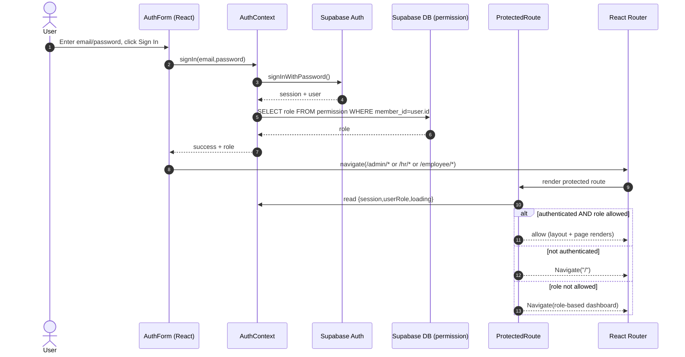
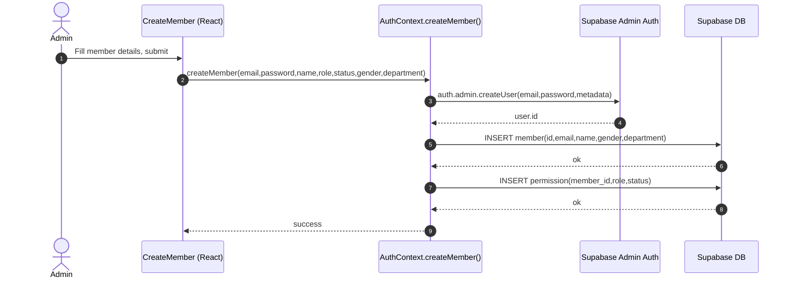
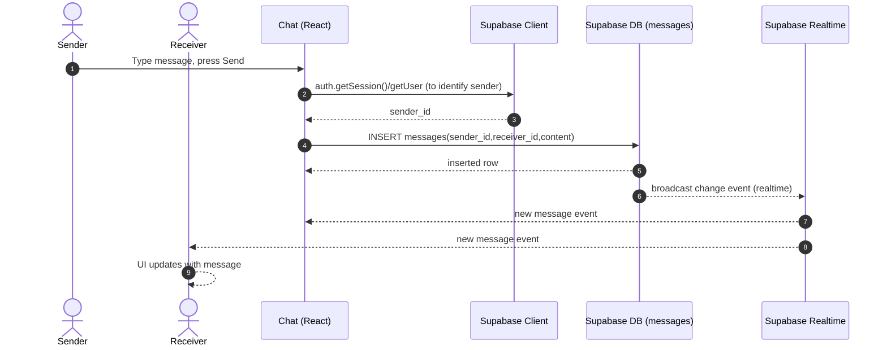

# 2) Sequence Diagram (How the system runs)

## A) Login → role fetch → routed dashboard

## B) Admin creates member (Supabase Admin API + DB rows)

## C) Employee sends a chat message (DB insert + realtime receive)

